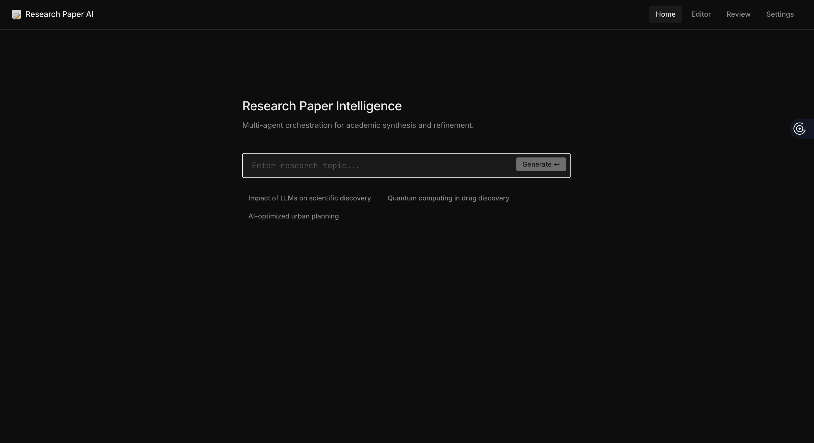
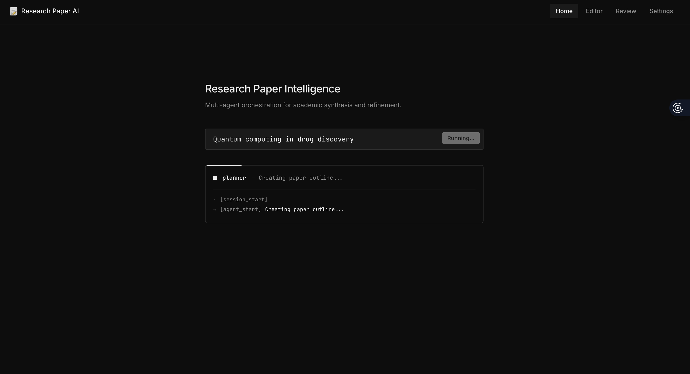
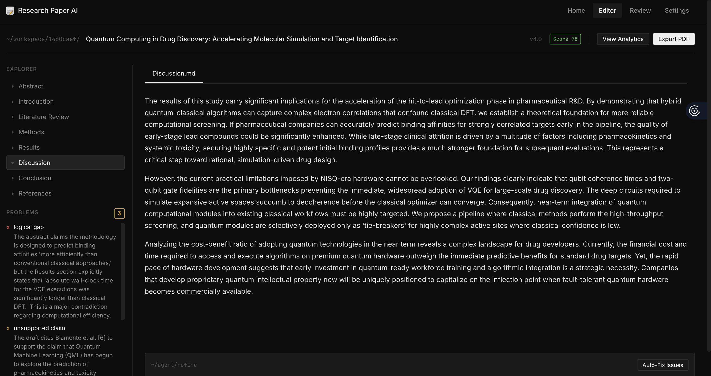
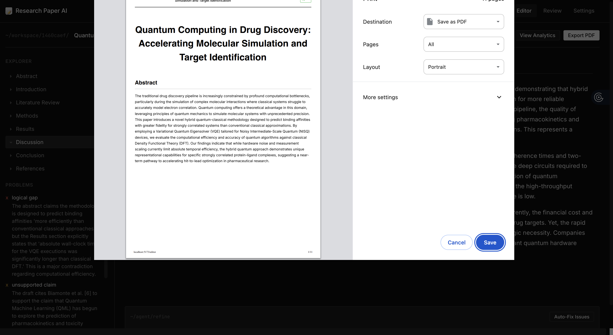

# 📝 Research Paper AI
**Multi-agent orchestration for academic synthesis and refinement.**


*Entering a research topic to kick off the multi-agent drafting process.*


*Tracking the agent pipeline in real-time as they research, evaluate, and assemble the paper.*


*The Interactive Editor: Reviewing the draft, generated visual analysis graphs, and automated critiques.*


*Generating a flawlessly formatted, publication-ready PDF straight from the browser.*

Research Paper AI is a next-generation academic drafting tool powered by a swarm of specialized LLM agents. Instead of a standard chatbot, it employs a sophisticated multi-agent pipeline to autonomously plan, research, write, cite, critique, and visually enhance research papers.

---

## Warning 🔴

-**Terms of use** Please don't submit these papers to scientifc papers, LLM's are currently not up to the task this is a tool to draft an idea for a paper however we discourge the use of this tool to write papers fully in the strongest terms 

## ✨ Key Features
- **Multi-Agent Orchestration:** Employs specialized AI agents (`planner`, `drafter`, `citation`, `validator`, `improver`, `graph_agent`, and `visual_review`) that pass data through a strict pipeline to synthesize rigorous academic papers.
- **Web-Grounded Citations:** The Citation Agent actively scrapes DuckDuckGo for real-world academic research and injects accurate citations into your document, formatted elegantly with full reference tracking.
- **Data Visualization Generation:** Automatically interprets numeric claims to generate and embed clean mathematical and analytical graphs into the Results section.
- **Iterative Refinement Loop:** Direct an agent directly on the page (e.g. "Make this section more technical") and watch the orchestrator re-run the `improver` and `validator` passes to apply your edits, re-calculate the quality score, and auto-fix logical gaps.
- **Advanced Math Formatting:** Native support for rigorous algebraic and scientific LaTeX formatting (`react-markdown` + `remark-math` + `rehype-katex`), beautifully typesetting any `$$E=mc^2$$` output natively on the page.
- **Academic PDF Exporter:** A custom `@media print` stylesheet automatically hides all application UI, expands the document, inserts all graphs, and natively interfaces with your browser to cleanly export a beautifully formatted, publication-ready PDF.
- **Model Agnostic Backend:** Swap between the latest flagship models (`gemini-3.1-pro-preview`, `gpt-4o`, `o3-mini`, `mistral-large-latest`) with a built-in unified `litellm` wrapper.

---

## 🏗 System Architecture

The project is split into a **React/Vite Frontend** and a **FastAPI/Python Backend**.

### 1. The Frontend (React)
- **Home Dashboard:** Allows you to input a topic and streams the Multi-Agent pipeline steps via SSE (Server-Sent Events) in a clean terminal-style loader.
- **Interactive Editor:** Features a 2-column layout. The left pane shows the manuscript outline and a real-time list of "Problems/Critiques" identified by the Validator agent. The main canvas displays the dynamically rendered paper with math typing and graphical figures.
- **Refinement CLI:** A built-in terminal at the bottom of the editor lets you send direct conversational commands back to the AI Swarm to explicitly rewrite/improve the draft.
- **Fully Responsive Print State:** Clicking "Export PDF" completely restructures the DOM into a continuous, white-background academic paper for clean browser-printing.

### 2. The Backend (FastAPI + LiteLLM)
- The core logic is housed in `orchestrator.py`, which routes the paper state intelligently through various Python classes in the `/agents` directory.
- `llm_helper.py` normalizes API connections using `litellm`. Crucially, it overrides standard timeout defaults (granting 3600 seconds) to accommodate next-gen reasoning models handling massive multi-page generation contexts.
- Uses `asyncio.to_thread` and strict timeouts to prevent synchronous third-party scrapers (like DuckDuckGo) from crashing the ASGI event loop.

---

## 🚀 Getting Started

### Prerequisites
- Node.js (for frontend)
- Python 3.10+ (for backend)

### Backend Setup
```bash
cd backend
python -m venv venv
source venv/bin/activate
pip install -r requirements.txt
cp .env.example .env # Add your GEMINI / OPENAI / MISTRAL api keys here
uvicorn main:app --reload --port 8000
```

### Frontend Setup
```bash
cd frontend
npm install
npm run dev
```

Browse to `http://localhost:5173` to start creating your first paper!

---
## 🛠 Recent Updates
- Integrated an invisible full-paper `print-only` container to ensure all text and dynamically generated graphics are naturally exported onto the exported PDF.
- Upgraded the `get_search_context` DDGS execution to use a threaded `asyncio.wait_for` wrapper, guaranteeing that dropped connections do not freeze the backend event loop.
- Reorganized the Iteration pipeline: The Orchestrator now correctly forces the `Validator` to evaluate the *newly refreshed* draft directly after the `Improver` has applied the user's refinement instructions, ensuring the UI's Quality Score is precisely accurate.
- Overhauled Editor SSE Stream handlers to aggressively intercept backend exceptions and trigger frontend Error Alerts instead of failing silently.
